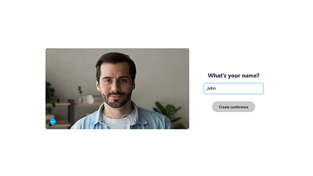

# Simple meeting application

Users can create a video meeting and can access to the meeting room with a link. There is no authentication. Replicated Google Meet as much as possible.

## Functionality

* Video/Voice call
* Text messaging

## How to run this project?

First, install node modules:

```
npm install
```

Second, run the development server.

```
npm run dev
```

You can see the following screens:




This project is paired with [this repo](https://github.com/phantom-98/socket.io-server) and requires `.env` file which has two env variables:
```
VITE_SOCKETIO_SERVER=       // your socket io server url
VITE_PEERJS_SERVER=         // your peerjs server. it can be "0.peerjs.com"
```

## Tech stack

* React + Vite
* Socket.io
* PeerJS
* Voice Activity Detection

## Deployment on Vercel

This project is live on [https://simple-meet.vercel.app](https://simple-meet.vercel.app)

Since it is impossible to deploy socket.io server with free service, I used a live socket.io server from one of my past project.